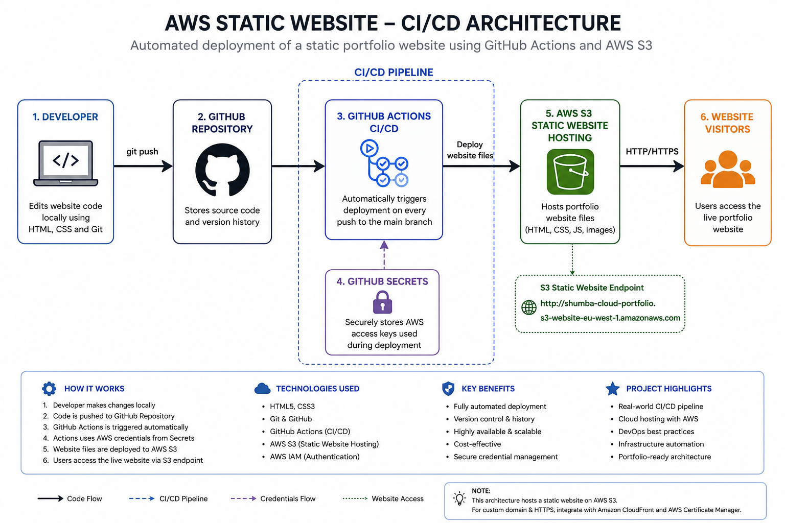

I've created an AWS S3 hosted static website. I locally compiled my code using VS and hosted it in my S3 bucket, then I was able to host it through the bucket using the static website hosting feature on AWS.

I figured if this were an actual live website for an enterprise, modifications would be something that needs to be done most of the time to update the website with presumably new information, whatever the case may be.

To modify a website hosted in an S3 bucket, you would need to manually upload your newly updated HTML code into the bucket. This is a lengthy process that requires you to log into the Amazon interface, put in your password, and do all of the boring stuff.

So I thought to myself, "Why not simplify the process of updating the code?"

That's where GitHub comes in, my friend. It allows me to automate this process and reduce the time it takes to update the code.

With Git, I was able to create a CI/CD pipeline that allows me to update my code right after saving it locally in my compiler and then, using my PowerShell terminal, deploy it with just 3 lines of code — very short code at that.

This is the perfect and efficient solution for a very capable but lazy engineer like myself.

This here is a solution for efficiency.

here is a daigram explaining the whole project:

  

